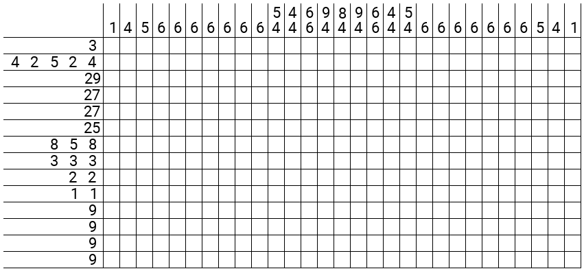

# Simple Nonogram Generator

The input is a plain text file containing the desired image, like this:

```text
-------------XXX-------------
-XXXX---XX--XXXXX--XX---XXXX-
XXXXXXXXXXXXXXXXXXXXXXXXXXXXX
-XXXXXXXXXXXXXXXXXXXXXXXXXXX-
-XXXXXXXXXXXXXXXXXXXXXXXXXXX-
--XXXXXXXXXXXXXXXXXXXXXXXXX--
---XXXXXXXX-XXXXX-XXXXXXXX---
-----XXX-----XXX-----XXX-----
------------XX-XX------------
------------X---X------------
----------XXXXXXXXX----------
----------XXXXXXXXX----------
----------XXXXXXXXX----------
----------XXXXXXXXX----------

```

Each line must contain the same number of characters. All `X` characters are treated as filled in squares, while anything else is treated as an empty square.

The program produces a PNG file containing the Nonogram that generates the desired image when solved:



Note that the program does not check whether the resulting Nonogram has a unique solution, so you will have to verify solvability by hand.
